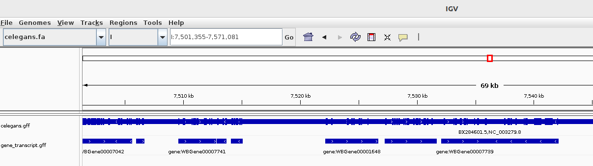
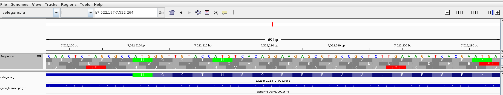
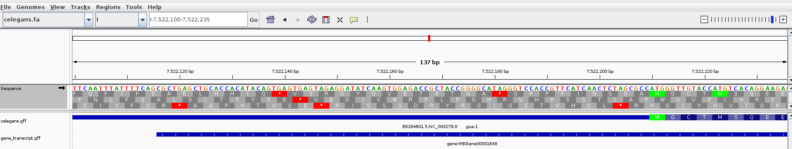
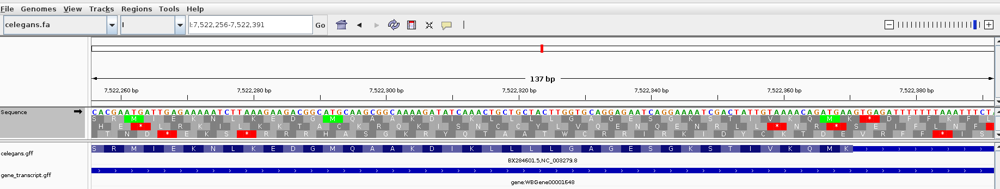
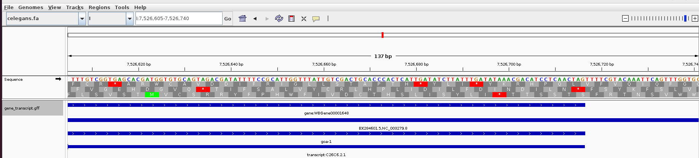

# Assignments for Week 03
## Use IGV to visualize your genome and the annotations relative to the genome.
```
wget https://ftp.ensemblgenomes.ebi.ac.uk/pub/current/metazoa/fasta/caenorhabditis_elegans/dna/Caenorhabditis_elegans.WBcel235.dna.toplevel.fa.gz

gunzip Caenorhabditis_elegans.WBcel235.dna.toplevel.fa.gz

mv Caenorhabditis_elegans.WBcel235.dna.toplevel.fa celegans.fa

wget https://ftp.ensemblgenomes.ebi.ac.uk/pub/current/metazoa/gff3/caenorhabditis_elegans/Caenorhabditis_elegans.WBcel235.62.gff3.gz

gunzip Caenorhabditis_elegans.WBcel235.62.gff3.gz

mv Caenorhabditis_elegans.WBcel235.62.gff3 celegans.gff
```


## How big is the genome, and how many features of each type does the GFF file contain?
```
seqkit stats celegans.fa
file           format  type  num_seqs      sum_len  min_len       avg_len     max_len
./celegans.fa  FASTA   DNA          7  100,286,401   13,794  14,326,628.7  20,924,180

grep -v '^#' celegans.gff | cut -f3 | sort-uniq-count-rank     
263117  exon
215849  CDS
31865   mRNA
27371   five_prime_UTR
26331   three_prime_UTR
24813   ncRNA_gene
19985   gene
15363   piRNA
8440    ncRNA
2165    pseudogenic_transcript
2128    pseudogene
634     tRNA
458     miRNA
346     snoRNA
306     lnc_RNA
262     pre_miRNA
129     snRNA
22      rRNA
10      miRNA primary transcript
7       chromosome
```

## From your GFF file, separate the intervals of type "gene" or "transcript" into a different file. Show the commands you used to do this.
```
cat celegans.gff | awk '$3 == "gene" || $3 == "transcript"' > gene_transcript.gff
```

## Visualize the simplified GFF in IGV as a separate track. Compare the visualization of the original GFF with the simplified GFF.


## Zoom in to see the sequences, expand the view to show the translation table in IGV. Note how the translation table needs to be displayed in the correct orientation for it to make sense.


## Visually verify that the first coding sequence of a gene starts with a start codon and that the last coding sequence of a gene ends with a stop codon.


