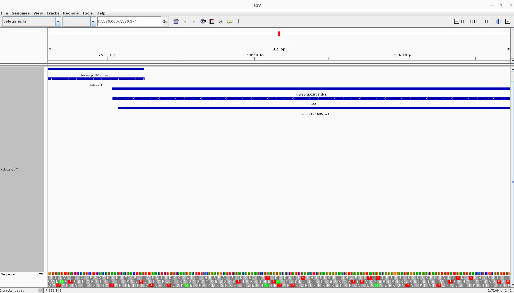

# Assignments for Week 03
## Use IGV to visualize your genome and the annotations relative to the genome.
```
wget https://ftp.ensemblgenomes.ebi.ac.uk/pub/current/metazoa/fasta/caenorhabditis_elegans/dna/Caenorhabditis_elegans.WBcel235.dna.toplevel.fa.gz

gunzip Caenorhabditis_elegans.WBcel235.dna.toplevel.fa.gz

mv Caenorhabditis_elegans.WBcel235.dna.toplevel.fa celegans.fa

wget https://ftp.ensemblgenomes.ebi.ac.uk/pub/current/metazoa/gff3/caenorhabditis_elegans/Caenorhabditis_elegans.WBcel235.62.gff3.gz

gunzip Caenorhabditis_elegans.WBcel235.62.gff3.gz

mv Caenorhabditis_elegans.WBcel235.62.gff3 celegans.gff
```
