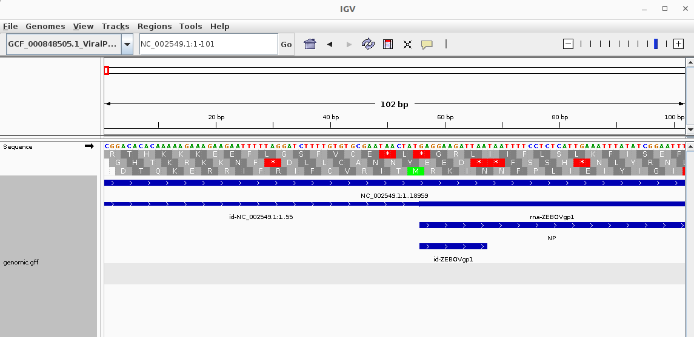
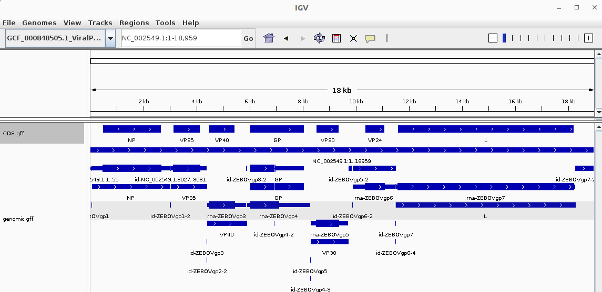

# Assignments for Week 04
## Group 1: Ebola paper
## Data retrieval:
### Identify the accession numbers for the genome referenced in your assigned paper.
the paper: https://www.science.org/doi/full/10.1126/science.1259657
Sequence data are available at NCBI (NCBI BioGroup: PRJNA257197). 
GCF_000848505.1 is NCBI Assembly ID for Ebola virus/H.sapiens-tc/COD/1976/Yambuku-Mayinga
### Write shell commands to download the genome and annotation data. Ensure your commands are reusable and reproducible.
```
datasets download genome accession GCF_000848505.1 --include genome,gff3,gtf
$ unzip -n ncbi_dataset.zip
```
## Visualization:
### Use IGV to visualize the genome and its annotations (e.g., GFF file) relative to the genome sequence.



## Data evaluation:
### Determine the genome size and count the number of features of each type in the GFF file.
```
cat genomic.gff | head -n 10

## sequence-region NC_002549.1 1 18959
```
```
cat genomic.gff | grep -v '^#' | cut -f 3 | sort-uniq-count-rank

11      CDS
8       polyA_signal_sequence
8       regulatory_region
7       exon
7       gene
7       mRNA
4       sequence_feature
1       five_prime_UTR
1       region
1       three_prime_UTR
```
### Identify the longest gene. What is its name and function?
```
awk '$3 == "gene" {print $5-$4+1,$0} ' genomic.gff | sort -nr | head -n 1
6782 NC_002549.1        RefSeq  gene    11501   18282   .       +       .       ID=gene-ZEBOVgp7;Dbxref=GeneID:911824;Name=L;gbkey=Gene;gene=L;gene_biotype=protein_coding;locus_tag=ZEBOVgp7
```

### Pick another gene, and describe its name and function.
```
awk '$3 == "gene" {print $5-$4+1,$0} ' genomic.gff | sort -nr | tail -n 1
1376 NC_002549.1        RefSeq  gene    3032    4407    .       +       .       ID=gene-ZEBOVgp2;Dbxref=GeneID:911827;Name=VP35;gbkey=Gene;gene=VP35;gene_biotype=protein_coding;locus_tag=ZEBOVgp2
```
### Examine the distribution of genomic features: Are they closely packed or is there significant intergenic space?

Using IGV visualization, I can clearly see that the genomic features are closely packed, as they are basically connected one by another. 

### Using IGV, estimate what proportion of the genome is covered by coding sequences.
```
awk '$3 =="CDS"' genomic.gff > CDS.gff
```

I extracted the CDS features and load it into IGV. As it can be seen from the image, coding sequences covers about 80% of the genome. We can do a calculation.
```
awk '{print $5-$4+1}' CDS.gff | awk '{sum+=$1} END {print sum}'
16506
16506 / 18959 = 87%
```

## Alternative genome builds:
### Find alternative genome builds for your organism (include their accession numbers).
```
bio fetch KM233118 --format fasta > Ebola-2014.fa
```
### Briefly discuss what different questions could be answered using a different genome build, considering the focus of your assigned paper.
This alternative genome of Ebola virus came from the original paper: https://www.science.org/doi/full/10.1126/science.1259657
Based on my current knowledge, the difference in those genome assemblies may indicate how the virus got evloved over time. They may develop new characteristics like drug resistance or transmission capacity. We may also use the difference of genome assemblies to study the origin and epidemic features of a outbreak in order to stop it.